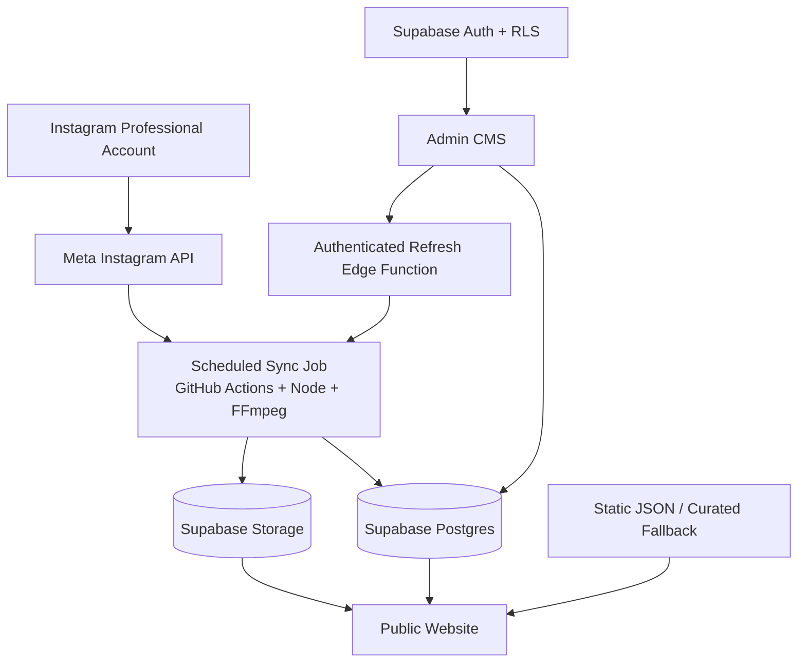

# Instagram Feed Sync & CMS Service Blueprint

> 版本：1.0  
> 更新日期：2026-08-28  
> 用途：將「前台自動顯示 Instagram Feed＋後台管理展示內容」整理成可複製、部署與銷售的標準服務。

## 1. 產品定位

這是一套替品牌官網同步 Instagram 專業帳號內容的輕量內容服務。系統會定期取得帳號貼文、將圖片與影片封存到自有 Storage、保存貼文資料，並讓管理者從後台挑選、排序與命名前台要展示的內容。

第一階段建議採用 **Single-tenant／每位客戶獨立部署**：每個客戶擁有獨立的 Meta App、Supabase Project、GitHub Repository、Storage 與管理者帳號。這種模式較容易銷售、備份、移交與隔離資料，也能降低某位客戶的權杖或流量問題影響其他客戶的風險。

本文件不是完整 SaaS 多租戶規格。若未來要改成單一平台服務多位客戶，需另行設計 tenant、方案計費、用量限制、OAuth onboarding、資料刪除與跨租戶隔離。

## 2. 核心價值

- Instagram 發布後，不需再次手動上傳到網站。
- 圖片、Carousel 與 Reels 可在網站原生展示，不必完全依賴 Instagram Embed。
- 貼文永久保存到自有資料庫與媒體空間，不會因前台只顯示 20 則而遺失舊內容。
- 管理者可決定要顯示哪些貼文、調整順序，以及覆寫網站燈箱標題。
- 即使 Meta API 或同步程序暫時失敗，前台仍可使用上一次成功資料或靜態備援。
- 權杖與高權限金鑰只存在伺服器端 Secret，不放入前台程式碼。

## 3. 服務範圍

### 3.1 標準版必備功能

1. 從客戶自己的 Instagram 專業帳號讀取貼文。
2. 依 API pagination 取得可存取的歷史內容，而非只抓最新 20 則。
3. 支援 `IMAGE`、`VIDEO`、`CAROUSEL_ALBUM`。
4. 將封面、Carousel 圖片及可取得的 Reel 影片封存至 Supabase Storage。
5. 將貼文中繼資料 upsert 至 Supabase Database，不因重新同步建立重複資料。
6. 第一次匯入時自動選取最新 20 則；之後的新貼文只進入作品庫，不自動取代人工編排。
7. 前台最多顯示 20 則，可另從其中抽取較少數量做精選牆。
8. 後台可登入、立即刷新、選擇顯示、移除顯示、調整順序、覆寫燈箱標題。
9. 圖片可燈箱檢視；Carousel 有上一張、下一張、計數與鍵盤方向鍵；Reel 優先原生播放。
10. 同步失敗時保留最後一次成功資料，不清空前台。

### 3.2 選配功能

- 自訂前台版型：瀑布流、橫向 Feed、Grid、精選卡片。
- 顯示貼文日期、類型、標籤或自訂分類。
- 多位管理者與 `admin`／`editor` 權限分級。
- 私有 Storage＋Signed URL。
- 同步通知：Email、Slack、LINE 或 Discord。
- 同步紀錄、錯誤儀表板與用量統計。
- Webhook／事件式同步；仍保留排程作為補償機制。
- CDN、影像轉檔、WebP／AVIF 衍生檔與不同尺寸 responsive images。

### 3.3 不包含於標準版

- 代替客戶取得其 Instagram 密碼。
- 爬蟲、非官方登入、自動化模擬真人瀏覽 Instagram。
- 保證取得 API 未提供的音樂、Insights、留言、私訊或受版權限制的媒體。
- 替客戶取得未授權的第三方帳號內容。
- Meta App Review 必然通過的保證。

## 4. 建議架構



### 4.1 為什麼同步工作使用 GitHub Actions

同步會下載大量圖片或影片，必要時也會透過 FFmpeg 壓縮 MP4。這類工作比短時間 Edge Function 更適合放在 CI runner 或 background worker。Supabase Edge Function 只負責驗證管理者並安全觸發同步，不負責長時間下載與轉檔。

### 4.2 建議拆成兩個 Workflow

商品化版本應將目前的「網站部署＋IG 同步」拆開：

- `deploy-site.yml`：網站程式碼變更時部署。
- `sync-instagram.yml`：排程或管理者按「立即刷新」時同步內容。

前台直接讀 Supabase，因此一般內容同步不需要重新部署網站。靜態 JSON snapshot 可由同步流程另行保存，但不應成為每次刷新都重新發布整個網站的必要條件。

## 5. 技術基準

| 層級 | 建議技術 | 責任 |
|---|---|---|
| Instagram | Meta Instagram API | 取得帳號本身的媒體、caption、permalink、timestamp 與 children |
| 同步 Worker | Node.js 20+ | Pagination、資料清理、下載、upsert、產生 fallback |
| 影片處理 | FFmpeg | H.264 MP4、限制寬度、壓縮與 faststart |
| Database | Supabase Postgres | 永久作品庫、顯示狀態、排序與標題覆寫 |
| Storage | Supabase Storage | 封面、Carousel、影片資產 |
| Auth | Supabase Auth | 管理者登入與 session |
| Authorization | Postgres RLS＋角色資料表 | 公開唯讀、管理者寫入、Worker 高權限 |
| On-demand Sync | Supabase Edge Function | 驗證管理者後觸發 GitHub workflow |
| 前台 | Framework-neutral JS adapter | 取得已選貼文、映射 UI、失敗 fallback |
| 後台 | HTML／JS 或既有前端框架 | 選擇、排序、標題與同步控制 |

## 6. 可複製資產清單

目前 NeoRealm LAB 專案可作為來源，但商品模板必須移除所有品牌專屬值。

| 資產 | 目前參考位置 | 商品化處理 |
|---|---|---|
| Instagram 同步程式 | `scripts/sync-instagram.mjs` | 抽出品牌名稱、帳號名稱、路徑與限制為設定值 |
| Workflow | `.github/workflows/deploy-pages.yml` | 拆成 deploy 與 sync 兩份，移除固定 user ID／Supabase URL |
| Database schema | `supabase/migrations/20260824170000_instagram_library.sql` | 保留 schema，將上限與命名參數化或文件化 |
| Auth／角色 schema | `supabase/migrations/20260824130000_neorealm_admin.sql` | 保留 `profiles`／role／RLS，移除 email 白名單依賴 |
| Refresh Edge Function | `supabase/functions/refresh-instagram/index.ts` | 將 origin、repo、workflow、branch 改由 secrets／env 取得 |
| 前台 adapter | `prototype/supabase-client.js` | Supabase URL、publishable key、bucket 與 fallback 路徑改成 config |
| 前台 hydration／燈箱 | `prototype/app.js` | 抽成可安裝 module 或 framework component |
| 後台 UI | `prototype/admin.html`、`prototype/admin-supabase.js` | 抽離 NeoRealm 文案、固定 email 與網站作品管理功能 |
| 後台樣式 | `prototype/admin.css` | 建立 theme tokens，支援客戶品牌色與字體 |
| Static fallback | `prototype/data/instagram-feed.json` | 提供空白範本與 schema 驗證 |
| 安全掃描 | `scripts/security-audit.mjs` | 納入模板 CI，擴充 secret patterns |
| 操作文件 | 本文件 | 每個客戶複製一份 deployment record |

## 7. 商品模板建議目錄

```text
instagram-feed-service/
├─ README.md
├─ CHANGELOG.md
├─ LICENSE.md
├─ .env.example
├─ config/
│  └─ service.config.example.json
├─ src/
│  ├─ client/
│  │  ├─ instagram-feed-adapter.js
│  │  ├─ instagram-gallery.js
│  │  └─ instagram-lightbox.js
│  └─ admin/
│     ├─ admin.html
│     ├─ admin.js
│     └─ admin.css
├─ scripts/
│  ├─ sync-instagram.mjs
│  ├─ validate-config.mjs
│  └─ security-audit.mjs
├─ supabase/
│  ├─ migrations/
│  │  ├─ 001_roles.sql
│  │  ├─ 002_instagram_posts.sql
│  │  └─ 003_storage.sql
│  ├─ functions/
│  │  └─ refresh-instagram/index.ts
│  └─ tests/
│     └─ instagram_rls.test.sql
├─ .github/workflows/
│  ├─ deploy-site.yml
│  └─ sync-instagram.yml
├─ public/data/
│  └─ instagram-feed.json
└─ docs/
   ├─ CLIENT-ONBOARDING.md
   ├─ DEPLOYMENT.md
   ├─ ADMIN-GUIDE.md
   ├─ OPERATIONS.md
   └─ SECURITY.md
```

## 8. 設定規格

### 8.1 公開設定

公開設定可以出現在前台，但仍應集中管理，不散落於程式碼。

```json
{
  "accountHandle": "client_account",
  "supabaseUrl": "https://PROJECT_REF.supabase.co",
  "supabasePublishableKey": "sb_publishable_xxx",
  "storageBucket": "instagram-media",
  "publicLimit": 20,
  "featuredLimit": 10,
  "fallbackFeedUrl": "/data/instagram-feed.json",
  "adminPath": "/admin/"
}
```

Publishable key 可以存在瀏覽器，但前提是所有 exposed tables 與 Storage 都正確啟用 RLS／grants。Secret key 或 legacy `service_role` 絕對不能放在此設定。

### 8.2 GitHub Actions Secrets

| Secret | 用途 | 必填 |
|---|---|---|
| `INSTAGRAM_ACCESS_TOKEN` | Meta Instagram API access token | 是 |
| `SUPABASE_SECRET_KEY` | Worker 寫入 Database／Storage | 是 |
| `SUPABASE_URL` | Supabase project endpoint；也可使用 Repository Variable | 是 |
| `INSTAGRAM_ACCOUNT_ID` | Instagram account／user ID；也可使用 Repository Variable | 視 API 流程 |

新專案優先使用 Supabase `sb_secret_...` secret key；若沿用 legacy `service_role`，需標記為技術債並安排遷移。兩者都不可輸出到 log 或前台。

### 8.3 Supabase Edge Function Secrets

| Secret | 用途 |
|---|---|
| `GITHUB_ACTIONS_TOKEN` | 觸發指定 repository 的 workflow；只授予 Actions write |
| `GITHUB_OWNER` | 客戶 GitHub owner |
| `GITHUB_REPO` | 客戶 repository |
| `GITHUB_WORKFLOW_ID` | 例如 `sync-instagram.yml` |
| `GITHUB_REF` | 通常為 `main` |
| `ALLOWED_ORIGINS` | 逗號分隔的正式、staging 與 localhost origin |

Supabase 平台會提供專案相關環境變數。自訂 secrets 使用 Dashboard 或 `supabase secrets set` 建立，切勿提交 `.env`。

### 8.4 不可硬編碼項目

- Instagram account ID、handle 與 access token。
- Supabase URL、secret key、bucket 名稱。
- 管理者 email。
- GitHub owner、repo、workflow 與 branch。
- CORS allowed origins。
- 前台最多顯示數量。
- 品牌文案、alt text fallback 與燈箱預設標題。

## 9. Database 規格

### 9.1 `instagram_posts`

| 欄位 | 型別 | 規則 |
|---|---|---|
| `media_id` | `text` PK | Instagram media ID，upsert key |
| `title` | `text` | 自 caption 推導的預設標題，建議 ≤120 字 |
| `description` | `text` | 清理後 caption，建議 ≤2200 字 |
| `alt_text` | `text` | 網站替代文字，建議 ≤240 字 |
| `media_type` | `text` | `IMAGE`／`VIDEO`／`CAROUSEL_ALBUM` |
| `cover_path` | `text` | Storage path，不存 secret URL |
| `video_path` | `text nullable` | Storage path；暫時遠端 URL 必須另外標記，不可混用 |
| `permalink` | `text` | 原 Instagram 貼文網址，限 HTTPS |
| `carousel` | `jsonb` | `{path, mediaType}` array |
| `posted_at` | `timestamptz` | Instagram 發布時間 |
| `visible` | `boolean` | 是否顯示於前台 |
| `display_order` | `integer nullable` | 前台排序；visible 時不可為 null |
| `synced_at` | `timestamptz` | 最近同步時間 |
| `created_at`／`updated_at` | `timestamptz` | 系統時間 |

### 9.2 `instagram_title_overrides`

| 欄位 | 型別 | 規則 |
|---|---|---|
| `media_id` | `text` PK | 對應 `instagram_posts.media_id` |
| `title` | `text` | 管理者輸入的網站燈箱標題 |
| `updated_by` | `uuid` | 對應 Auth user |
| `updated_at` | `timestamptz` | 更新時間 |

正式模板建議加入 foreign key，並明確決定刪除貼文時 override 要 `cascade` 或保留稽核紀錄。

### 9.3 `profiles`

| 欄位 | 型別 | 規則 |
|---|---|---|
| `id` | `uuid` PK | 對應 `auth.users.id` |
| `display_name` | `text` | 管理者名稱 |
| `role` | enum | `admin`／`editor` |

權限應依 `profiles.role` 判斷，不應只在 JavaScript 或 Edge Function 比對某一個固定 email。

### 9.4 建議新增 `instagram_sync_runs`

商品化版本應記錄同步歷程：

```text
id, started_at, finished_at, status,
fetched_count, inserted_count, updated_count,
asset_failure_count, triggered_by, error_summary
```

前台不開放讀取；只有管理者及 Worker 可存取。

## 10. RLS 與 Storage 權限矩陣

| 動作 | anon | authenticated editor/admin | sync worker secret |
|---|---:|---:|---:|
| 讀取 visible posts | 允許 | 允許 | 允許 |
| 讀取 hidden posts | 拒絕 | 允許 | 允許 |
| 修改 visible／order／override | 拒絕 | 允許 | 允許 |
| 新增或 upsert API posts | 拒絕 | 原則上拒絕 | 允許 |
| 讀取公開 media | 允許 | 允許 | 允許 |
| 上傳／覆寫同步 media | 拒絕 | 原則上拒絕 | 允許 |
| 觸發 refresh function | 拒絕 | 允許 | 不需要 |

每一張 exposed table 都必須同時檢查：

1. `enable row level security`。
2. SQL grants 是否符合用途。
3. 每個 operation 的 policy 是否存在。
4. `anon` 與一般 authenticated user 的拒絕測試。
5. admin／editor 的允許測試。

只寫 policy 而未收緊 grants 並不等於完整保護。

## 11. Storage 規格

### 11.1 Bucket

- 名稱：預設 `instagram-media`，允許設定覆寫。
- 標準版：public read、worker write。
- 建議檔案上限：50 MB；超過前先轉檔。
- MIME allowlist：`image/jpeg`、`image/png`、`image/webp`、`video/mp4`。

### 11.2 Object path

```text
{media_id}/cover.{ext}
{media_id}/video.mp4
{media_id}/slide-1.{ext}
{media_id}/slide-2.{ext}
```

不使用 caption、username 或原始 filename 作為 path，避免特殊字元與隱私問題。

### 11.3 影片基準

目前可沿用：

```text
Video: H.264, width ≤ 720px, even-numbered height, CRF 24
Audio: AAC 128 kbps
Container: MP4 with faststart
```

若客戶重視畫質，可建立 720p／1080p 兩種方案並調整 Storage 配額。不得在瀏覽器直接載入原始超大 Reel 作為唯一來源。

## 12. 同步演算法

```text
1. 驗證所有必要 secrets 與公開設定。
2. 呼叫 Instagram media endpoint，limit 100。
3. 追蹤 paging.next，直到無下一頁或達安全頁數上限。
4. 驗證 media id、permalink、media type 與必要來源 URL。
5. 取得資料庫既有記錄，避免重複下載已封存資產。
6. IMAGE：下載 media URL 作 cover。
7. VIDEO：下載 thumbnail 作 cover；下載 video，必要時 FFmpeg 轉檔。
8. CAROUSEL：逐一保存 children；保留順序與 media type。
9. 清理 caption 空白並推導預設 title／alt。
10. 以 media_id upsert，中途失敗不可刪除既有成功資料。
11. 第一次同步且尚無 visible 資料時，選最新 N 則。
12. 後續新貼文預設 visible=false。
13. 更新 sync run 記錄與 fallback snapshot。
14. 成功後輸出摘要；失敗時 log 不得包含 token 或完整遠端 URL。
```

### 12.1 Idempotency

- 重跑同一批貼文不產生重複 rows。
- 已有 cover／video／carousel 時不重複下載，除非明確執行 repair。
- 排程、手動刷新與部署同時發生時，使用 concurrency lock，避免兩個同步互相覆蓋。

### 12.2 Retention

- Instagram 第 21 則之後的舊貼文仍保留於作品庫。
- Instagram 上被刪除或封存的貼文，預設不自動從資料庫刪除。
- 若要遵循客戶刪除要求，提供管理端「永久刪除資料與 Storage」流程，並留下 audit log。

## 13. 前台資料契約

標準 adapter 應輸出：

```json
{
  "id": "MEDIA_ID",
  "title": "Website display title",
  "description": "Sanitized caption",
  "alt": "Accessible description",
  "mediaType": "IMAGE",
  "src": "https://cdn.example/cover.jpg",
  "videoSrc": "",
  "permalink": "https://www.instagram.com/p/.../",
  "timestamp": "2026-08-28T00:00:00Z",
  "carousel": [
    { "src": "https://cdn.example/slide-1.jpg", "mediaType": "IMAGE" }
  ]
}
```

### 13.1 前台載入順序

1. 向 Supabase 查詢 `visible=true`，依 `display_order` 排序並限制 N 則。
2. 讀取 title overrides 並覆蓋自動標題。
3. 若 Supabase 失敗，載入 static JSON snapshot。
4. 若 snapshot 也失敗，保留網站內建 curated fallback。
5. 任一層成功都不應因單張媒體失敗而清空整個 Feed。

### 13.2 UI 驗收基準

- 圖片 loading 有固定背景與 loading state，避免閃現上一張內容。
- Feed 卡片保留一致版型；原圖比例差異由 `object-fit` 與燈箱完整顯示分工。
- Carousel 有按鈕、計數、鍵盤方向鍵與 mobile swipe。
- Reel 優先使用自有 MP4；失敗後才顯示 Instagram 官方連結或 embed。
- Caption 很長時在固定高度說明區內 scroll，不壓縮主要媒體。
- 燈箱關閉、焦點回復、Escape、reduced motion 與 mobile safe area 必須可用。

## 14. 後台規格

### 14.1 登入

- 使用 Supabase Auth。
- 前台程式碼只放 publishable key。
- 登入後再由 Database role／RLS 判斷是否為 content manager。
- 不以「知道 admin URL」或只比對前端 email 作為安全機制。
- 支援登出、session refresh、過期狀態與錯誤訊息。

### 14.2 作品庫

每則顯示：

- Cover thumbnail。
- 自動標題與發布日期。
- `IMAGE`／`VIDEO`／`CAROUSEL` 類型。
- 前台顯示 checkbox。
- 目前前台順序與上移／下移控制。
- 自訂燈箱標題欄位。
- 同步狀態或資產錯誤標記。

### 14.3 立即刷新

1. 管理者按下按鈕。
2. UI 禁用按鈕並顯示「正在啟動」。
3. Edge Function 驗證 user JWT、角色與 origin。
4. Edge Function 使用最小權限 GitHub token 觸發 `sync-instagram.yml`。
5. UI polling `synced_at` 或 sync run endpoint。
6. 完成後重新讀取作品庫並顯示新增、更新與失敗數量。
7. 超時時顯示「同步仍在背景執行」，不可宣告失敗或重複無限觸發。

### 14.4 顯示數量限制

限制必須由 Database transaction／RPC 強制執行，不能只靠 checkbox disabled。多位管理者同時操作時也不得超過上限。

## 15. Edge Function 規格

- 只允許 `POST` 與必要的 `OPTIONS`。
- 驗證 `Origin` allowlist。
- 驗證 Supabase user JWT。
- 查詢角色，不硬編碼 email。
- GitHub owner／repo／workflow／ref 由 secrets 取得。
- GitHub fine-grained token 只授權指定 repository 的 Actions write。
- 不回傳 GitHub token、Meta token、secret key 或內部錯誤細節。
- 成功回傳 `202 Accepted` 與可追蹤的 request／run ID。
- 加入 rate limit 或 cooldown，避免使用者連點消耗 Actions 額度。

GitHub workflow 必須存在於 default branch，並宣告 `workflow_dispatch` 才能由 API 觸發。

## 16. 客戶建置 SOP

### Phase 0：資格與需求確認

- [ ] 客戶擁有 Instagram 帳號及媒體權利。
- [ ] 帳號符合 Meta API 使用條件；若需專業帳號則先完成切換。
- [ ] 確認網站網域、staging 網域、管理者 email。
- [ ] 確認展示數量、前台版型、是否需要 Reels／Carousel。
- [ ] 確認內容保存與刪除政策。
- [ ] 確認每月更新頻率、影片數量與 Storage 預估。

### Phase 1：建立客戶資源

1. 從商品模板建立新的 private repository。
2. 建立獨立 Supabase Project。
3. 建立或設定 Meta App，連結客戶 Instagram 帳號。
4. 取得必要 account ID 與 access token。
5. 建立正式與 staging 網域。

所有帳號原則上由客戶持有；服務商以 collaborator／developer 身份工作，避免交付時帳號所有權不清。

### Phase 2：Supabase Database／Storage

1. 連結 Supabase CLI project。
2. 套用 migrations。
3. 建立 `instagram-media` bucket 與 policies。
4. 執行 RLS tests。
5. 建立第一位 Auth user。
6. 在 `profiles` 指派 `admin` role。
7. 以 anon、一般登入者、admin 三種身份測試 allow／deny。

### Phase 3：Meta API

1. 依 Meta 當下官方流程設定 Instagram API。
2. 設定 redirect URI、privacy policy、data deletion URL 等必要資料。
3. 只要求產品需要的最低權限。
4. 完成帳號授權並取得 access token。
5. 測試 media endpoint、pagination、VIDEO 與 children 回傳。
6. 將 token 放入 GitHub Secret，不貼到 issue、email、截圖或 source code。

Meta 權限名稱、審查要求、token 生命週期與 endpoint 會變動；每次新客戶建置前必須以官方文件重新確認，不可只照舊案截圖操作。

### Phase 4：GitHub Actions

1. 建立 repository secrets／variables。
2. 啟用 `sync-instagram.yml` 的 `workflow_dispatch`。
3. 設定排程；低更新頻率帳號可每日一次或每週數次。
4. 設定 `concurrency`，避免重複同步。
5. 手動執行一次，檢查 log、Database rows 與 Storage objects。
6. 確認 log 不含 token。

### Phase 5：Edge Function

1. 設定 GitHub token 與 repository secrets。
2. 設定 allowed origins。
3. 部署 `refresh-instagram`。
4. 以未登入、一般 user、admin、錯誤 origin 測試。
5. 從後台按「立即刷新」並確認 workflow 被觸發。

### Phase 6：前台整合

1. 填入公開 config。
2. 導入 Supabase SDK 與 feed adapter。
3. 將客戶現有 gallery container 接到標準資料契約。
4. 加入 loading、empty、error 與 fallback 狀態。
5. 驗證圖片、Reel、Carousel、caption overflow 與 permalink。
6. 測試 mobile、tablet、desktop、鍵盤與 reduced motion。

### Phase 7：後台整合

1. 套用品牌 theme tokens。
2. 測試登入、登出與 session 過期。
3. 測試新增貼文同步後預設不顯示。
4. 測試選取上限、排序與標題覆寫。
5. 測試兩位管理者同時操作。
6. 撰寫客戶版 `ADMIN-GUIDE.md`。

### Phase 8：上線與交付

1. 完成 security audit 與 dependency audit。
2. 備份 Database schema、設定與首次成功 snapshot。
3. 將客戶加入 GitHub、Supabase、Meta 管理權限。
4. 提供權杖更新、失敗排查、資料刪除與備份流程。
5. 記錄實際 project IDs、網域與負責人於不公開的 deployment record。
6. 確認監控與維護合約起始日。

## 17. 驗收清單

### 同步

- [ ] Pagination 可超過 20 則並保存全部可取得內容。
- [ ] 重跑不產生 duplicate rows／objects。
- [ ] 新貼文進作品庫但不擠掉人工精選。
- [ ] 舊貼文不因排序或第 21 則而刪除。
- [ ] 單張資產失敗不會清空整次同步成果。
- [ ] Token 失效時能留下可理解且不洩密的錯誤。

### 前台

- [ ] 只讀到 visible posts。
- [ ] 順序與後台一致。
- [ ] Reels 原生播放可用，失敗時有 fallback。
- [ ] Carousel 順序、按鈕、計數、鍵盤與 swipe 正常。
- [ ] 圖片比例不造成不必要裁切；燈箱完整顯示。
- [ ] Supabase 中斷時 snapshot／curated fallback 可用。

### 後台與安全

- [ ] 未登入無法讀取 hidden library 或修改資料。
- [ ] 非 content manager 無法更新 visible／order／title。
- [ ] 前台程式碼不存在 Meta token、GitHub token 或 Supabase secret key。
- [ ] RLS allow／deny tests 通過。
- [ ] Edge Function CORS、JWT、role 與 cooldown 通過。
- [ ] 管理操作失敗時 UI 會復原按鈕狀態並提供下一步。

## 18. 維運 SOP

### 每次同步

- 檢查 workflow conclusion。
- 檢查 fetched／upsert／asset failures 數量。
- 發生部分失敗時保留現有網站資料，建立 repair 任務。

### 每月

- 檢查 token／App 狀態與最近成功同步時間。
- 檢查 Storage 成長、影片大小與流量。
- 檢查未顯示作品數量及是否需要客戶編排。
- 檢查 GitHub Actions、Supabase 與第三方用量。

### 每季

- 核對 Meta API 官方文件、版本與 permissions。
- 更新 Node、Supabase SDK、GitHub Actions 版本。
- 執行 RLS、secret scan、dependency audit 與還原演練。
- 清查離職或不再合作的管理者權限。

### Token 更新

1. 在 Meta 後台或官方流程取得新 token。
2. 更新 GitHub Secret。
3. 手動執行同步。
4. 確認成功後再撤銷舊 token。
5. 不在文件記錄 token 本身，只記錄更新日期與負責人。

## 19. 常見問題排查

| 症狀 | 優先檢查 | 處理 |
|---|---|---|
| 前台仍是舊貼文 | `synced_at`、visible selection、browser cache | 確認同步成功，再確認新貼文是否尚未被選取 |
| 立即刷新無反應 | session、Edge Function log、GitHub token scope | 重新登入；檢查 role、origin 與 Actions write |
| Workflow 401／403 | Meta token 或 GitHub／Supabase secret | 輪替 secret；不得把值貼進 log |
| Reel 只剩 Instagram embed | `video_path`、Storage upload、來源 URL 是否過期 | 執行 media repair；檢查影片大小與 FFmpeg |
| Carousel 只有封面 | children 權限／回傳、同步程式是否保存 children | 檢查 API payload 與子媒體 asset failures |
| 前台讀不到任何資料 | anon grant、RLS visible policy、publishable key | 依權限矩陣逐層測試 |
| 後台可登入但讀不到作品庫 | profile role、authenticated policy | 確認 Auth user ID 對應 profiles row |
| 顯示超過上限 | RPC／transaction 未套用或被前端直接更新繞過 | 收緊 update grants，強制使用安全 RPC |

## 20. 商品化前必修項目

目前 NeoRealm 實作可作為技術原型，但複製銷售前至少完成：

1. 將同步 workflow 從網站部署 workflow 拆出。
2. 移除 Edge Function 中固定的 NeoRealm origins、email、GitHub repo 與 branch。
3. 移除前台 Supabase client 中固定 project URL／key，改讀集中設定。
4. 管理者授權改查 `profiles.role`，不再依固定 email。
5. `video_path` 拆成 `storage_path` 與 `remote_fallback_url`，避免把短效外部 URL 當 Storage path。
6. Carousel 中的影片 child 應封存為可播放影片；若只保存 thumbnail，必須明確標記為 image fallback。
7. 加入 `instagram_sync_runs`、cooldown、錯誤摘要與 repair 流程。
8. 加入 Supabase RLS 自動測試與 config validation。
9. 建立 theme／copy adapter，確保客戶不會看到 NeoRealm 品牌文案。
10. 建立正式授權條款、維護範圍、第三方服務責任與資料刪除政策。

## 21. 銷售與交付建議

### 方案 A：Feed Sync

- 自動同步。
- 前台一種標準版型。
- 最新／人工選擇 N 則。
- 圖片與基本 Carousel。
- 基本維運文件。

### 方案 B：Feed Sync＋CMS

- 包含方案 A。
- 管理者登入。
- 永久作品庫、選擇、排序、標題覆寫。
- Reels 原生播放與 fallback。
- 立即刷新與同步狀態。

### 方案 C：Custom Experience

- 包含方案 B。
- 品牌化 UI、瀑布流、視差、WebGL 或互動燈箱。
- 多區塊 feed、精選規則與進階媒體優化。
- 監控、維護與季度 API／資安檢查。

報價應拆分為：一次性建置費、客製前端費、第三方帳號／用量費，以及月／季維護費。不要把 Meta、Supabase、GitHub 的第三方可用性包裝成永久保證。

## 22. 版本與移交規範

- 使用 semantic version：`MAJOR.MINOR.PATCH`。
- 每次客戶部署記錄模板版本與 migration 版本。
- 客戶客製程式與核心同步模組分離，方便升級。
- Secret 不隨 repository、壓縮檔或移交文件傳遞；由客戶帳號後台重新建立。
- 交付時提供：source、migrations、設定表、管理手冊、維運手冊、權限名單與最近一次備份。

## 23. 官方參考文件

建置新客戶前重新核對以下官方來源：

- Meta Instagram Platform：<https://developers.facebook.com/docs/instagram-platform/>
- Instagram API with Instagram Login：<https://developers.facebook.com/docs/instagram-platform/instagram-api-with-instagram-login/>
- Supabase Database security：<https://supabase.com/docs/guides/database/secure-data>
- Supabase Row Level Security：<https://supabase.com/docs/guides/database/postgres/row-level-security>
- Supabase Storage access control：<https://supabase.com/docs/guides/storage/security/access-control>
- Supabase Edge Function secrets：<https://supabase.com/docs/guides/functions/secrets>
- Supabase Edge Function authentication：<https://supabase.com/docs/guides/functions/auth>
- GitHub workflow dispatch API：<https://docs.github.com/en/rest/actions/workflows>
- GitHub workflow triggers：<https://docs.github.com/en/actions/reference/workflows-and-actions/events-that-trigger-workflows>

## 24. Definition of Done

此服務可被視為「可複製並銷售」的最低標準：

- 新客戶不修改核心程式，只填設定、建立 secrets、套 migrations 與 theme 即可部署。
- Repository 內搜尋不到上一位客戶的品牌名、email、網域、account ID 或 project ID。
- 同步、RLS、前台 fallback、後台權限與主要媒體類型都有自動或可重複的驗收步驟。
- 客戶擁有帳號與資料，可在不依賴原開發者私人帳號的情況下繼續運作。
- 同步失敗不會破壞已上線內容；管理者能辨識狀態並知道如何復原。
- 權杖輪替、資料刪除、備份還原與版本升級都有文件。

